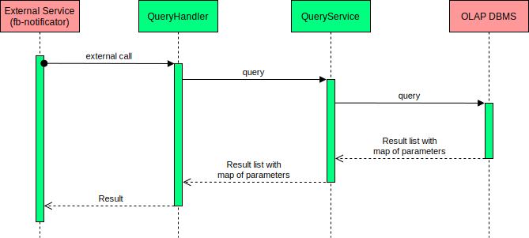

# fraudbusters-warehouse

fraudbusters-warehouse - сервис предназначен для взаимодействия с хранилищем данных системы антифрода (Fraudbusters).

В хранилище присутсвуют следующие данные:

- платежи, прошедшие через процессинг

- результаты работы антифрода

- мошеннические платежи

- чарджбеки и рефанды, осуществленные в результате работы процессинга

## Описание работы сервиса

Сервис является адаптером для взаимодейтсвия с OLAP базой данных. На текущий момент это Yandex Clickhouse. Сервис
принимает на вход текст запроса и список параметров для подстановки в него. Он формирует запрос и вызывает базу данных.
После чего формирует ответ в виде списка полей с их значениями и отдает получившийся результат вызывающему сервису. На
текущий момент с сервивом работает fraudbusters-notificator.

Общая схема взаимодействия:

Протокол взаимодействия описан [тут](https://github.com/rbkmoney/fraudbusters-warehouse-proto).